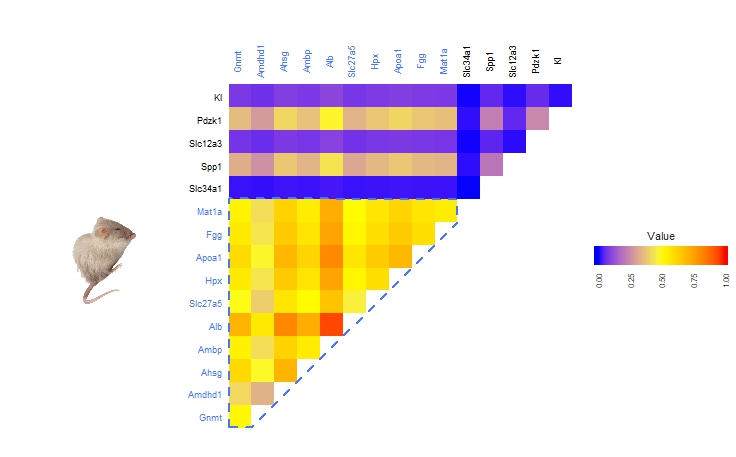
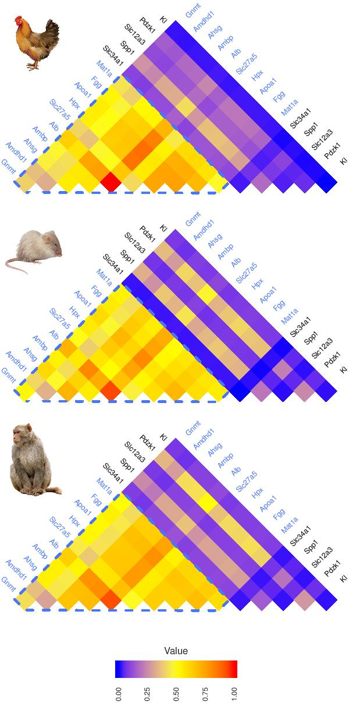
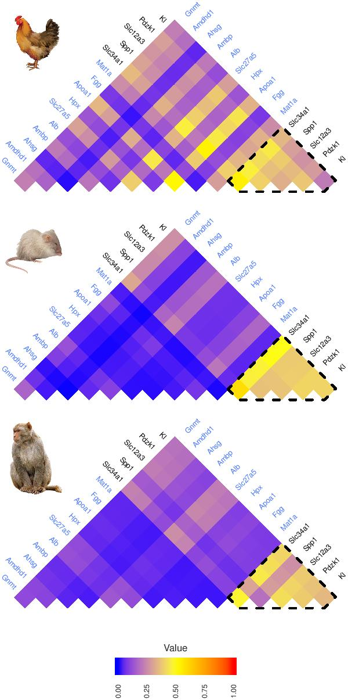
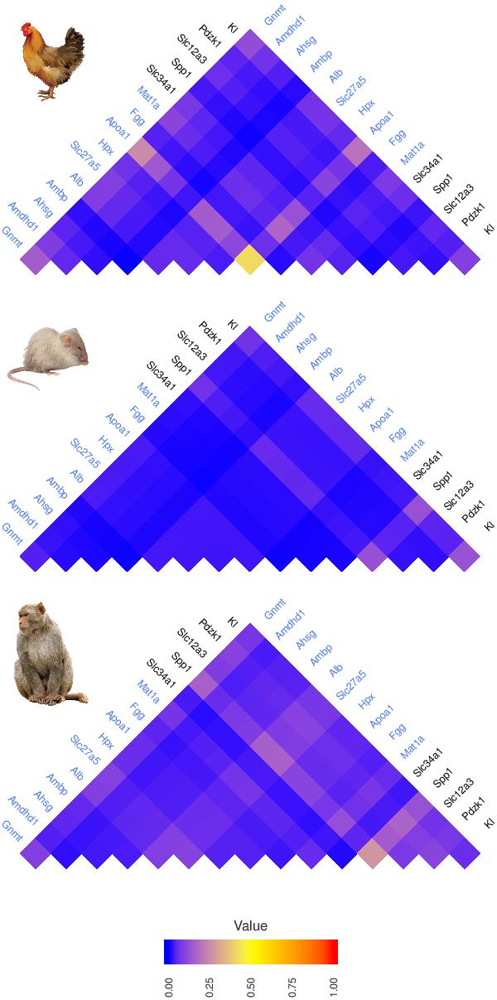

```{r setup, include = FALSE}
knitr::opts_chunk$set(
  collapse = TRUE,
  comment = "#>"
)
```

The `pineplot` package can be used to generate pine plots, which are stacked triangular heat maps that are generated using `ggplot2` and `grid`. Visualizing symmetric matrices in this way has the following benefits:

- Removes redundancy by removing half of the symmetric heat map
- Allows for visualizing more heatmaps in the same page, as it saves space
- Increases the margin space to allow for more annotation around axes
- Since each heat map is a `ggplot2` object, the heatmaps can be easily manipulated after creation before construction of a pine plot

# Example using gene expression data

As an example, we use RNA-seq data from Merkin and Brawand and focus on the counts of 15 genes that have been reported in literature as being tissue specific genes for liver or kidney. The data contains gene counts for three species (mouse, chicken, and macaque) and each species has several samples from three different tissues (liver, kidney, and brain). 

First, we split the raw table into 9 matrices. There are 3 matrices for each species, each containing the gene expression data of either liver, kidney, or brain tissue.

```
extract.tissue.species.profile <- function(tissue_specific_genes, grp){
  #tissue_specific_genes is a matrix of gene expression data
  #grp contains treatment/phenotype information
  # B represents brain samples in tissue_specific_genes
  # K represents kidney samples
  # L represents liver samples
  stopifnot(tissue %in% c("B", "K", "L"))
  mouse <- 1:12
  chicken <- 13:24
  macaque <- 25:37
  tissues <- c("K", "L", "B")
  all.species <- list("macaque"=macaque, "mouse"=mouse, "chicken"=chicken)
  profiles <- list()
  for(tissue in tissues){
    for(species.name in names(all.species)){
      profiles[[paste(tissue, species.name, sep="_")]] <- tissue_specific_genes[, all.species[[species.name]]][,which(grp[[species.name]]==tissue)]
    }
  }
  return(profiles)
}

# group information for matrix of gene expression matrix
grp <- list("chicken"=c("B", "B","K","K","L","L","B","K","B","K","L","K"),
            "mouse"=c("B","B","K","K","L","L", "B","K","L","B","K","L"),
            "macaque"=c("B","B","K","K","L","L","L","B","K","L","B","K","L"))

# split up tissue_specific_gene matrix by species and by tissue           
profiles <- extract.tissue.species.profile(tissue_specific_genes, grp)
```

## Constructing symmetric matrices from data

Each of these matrices can be transformed into a symmetric matrix by measuring the relationship between each of the genes. We use mutual expression, which is provided in the `pineplot` package as an example function to obtain a relationship between variables of interest. However, other options such as correlation may be more appropriate depending on the type of data visualized as well as the amount of data available. As an example, we generate the symmetric matrices for each species for liver tissue.

```
max.expression <- calculate_maximum(profiles)

gene.specific.layers <- function(tissue_specific_genes, tissue, max.expression){
  ch_grp <- c("B", "B","K","K","L","L","B","K","B","K","L","K")
  mu_grp <- c("B","B","K","K","L","L", "B","K","L","B","K","L")
  maca_grp <- c("B","B","K","K","L","L","L","B","K","L","B","K","L")
  stopifnot(tissue %in% c("B", "K", "L"))
  mouse <- 1:12
  chicken <- 13:24
  macaque <- 25:37
  
  layers <- list()
  chicken.profile <- tissue_specific_genes[, chicken][,which(ch_grp==tissue)]
  mouse.profile <- tissue_specific_genes[, mouse][,which(mu_grp==tissue)]
  macaque.profile <- tissue_specific_genes[, macaque][,which(maca_grp==tissue)]

  layers[["chicken"]] <- list(symmetric_matrix_generator(chicken.profile, max.expression))[[1]]
  layers[["mouse"]] <- list(symmetric_matrix_generator(mouse.profile, max.expression))[[1]]
  layers[["macaque"]] <- list(symmetric_matrix_generator(macaque.profile, max.expression))[[1]]
  
  return(layers)
}

layers <-  gene.specific.layers(tissue_specific_genes, "L", max.expression)

```

The symmetric matrices for all the tissues can be loaded for convenience. Each list is denoted with the tissue type. For example, the list containing symmetric matrices for liver tissue are contained in the list named "layers_L".

```
data(layers)
```

## Generating ggplot2 heat maps

Here, we generate the heat maps using `ggplot2` for the symmetric matrices for liver tissues in the 3 species of interest. This allows for customation after creation of the heat maps. A user may either use the standard parameters that have been set within the draw_heatmap function, or they may change the objects after they have been generated by adding "+" followed by `ggplot2` customization. 

```
generate.layers <- function(layers){
  heat_maps <- list()
  for(species in names(layers)){
    heat_maps[[species]] <- draw_heatmap(layers[[species]], 
                                         breaks=c(0, 0.25, 0.5, 0.75, 1),
                                         low="blue", mid="yellow", high="red", 
                                         lim = c(0,1), midpoint=0.5)
  }
  return(heat_maps)
}

maps <- generate.layers(layers_L) 
```

## Customization 

As each heat map is a `ggplot2` object, they can easily be annotated or manipulated aethtetically. In an example, we highlight genes specific to liver,colour code the genes axis labels that are specific to either liver (blue) or kidney (black), and add the image of mouse in the axes margins. Building the heatmap in this way gives complete control of the position and style of any image, text, legend etc. Any option available for `ggplot2` can be manipulated instead of relying on parameters offered by typical heatmap functions.

```
#add mouse image
mouse.img.address <- "./data/mouse.png"
img <- image_read(mouse.img.address)
img <- image_rotate(img, -45)
img <- rasterGrob(img, interpolate=TRUE)

ggplt.object <- maps[[2]] +
    theme(plot.margin = unit(c(0,0,0,9), "lines"),
          axis.text=element_text(colour=c(rep("royalblue1", 10), rep("black", 5))) ) +
          annotation_custom(grob=img, xmin=-8, xmax=-2, ymin=5, ymax=11)
    
area.of.interest <- data.frame(x = c(10.50, 11.50, 15.5, 15.50, 10.5, 10.50 ),
                                   y=c(10.50, 10.50, 14.50, 15.55, 15.55, 10.5))
area.border.col <- "black"

ggplt.object <- ggplt.object + geom_polygon(data=area.of.interest, 
                                            aes(x=x, y=y),
                                            colour=area.border.col,
                                            size=.8,
                                            linetype="dashed",
                                            fill=NA)

```

### Mouse ggplot2 customized heat map




## Visualize a pine plot

Since we want to customize every heatmap for the pine plot in the same manner, we write functions to make this process easier before calling the `write_pine_plot` function to stack these images into a pdf file.

```
custom_layer <- function(ggplt.heatmap, image.address, tissue){
  stopifnot(require("magick"))
  img <- image_read(image.address)
  # img <- image_read_svg(image.address)
  img <- image_rotate(img, -45)
  # png::writePNG(img, "bitmap.png")
  img <- rasterGrob(img, interpolate=TRUE)
  
  ggplt.object <- ggplt.heatmap +
    theme(plot.margin = unit(c(0,0,0,9), "lines"),
          axis.text=element_text(colour=c(rep("royalblue1", 10), rep("black", 5))) ) +
    annotation_custom(grob=img, xmin=-8, xmax=-2, ymin=5, ymax=11)
  if(tissue %in% c("K", "Kidney", "kidney")){
    area.of.interest <- data.frame(x = c(10.50, 11.50, 15.5, 15.50, 10.5, 10.50 ),
                                   y=c(10.50, 10.50, 14.50, 15.55, 15.55, 10.5))
    area.border.col <- "black"
  }else if(tissue %in% c("L", "Liver", "liver")){
    area.of.interest <- data.frame(x=c(0.50, 1.50, 10.50,  10.50, 0.50, 0.50 ),
                                   y=c(0.55, 0.55, 9.50, 10.50, 10.55, 0.55))
    area.border.col <- "royalblue1"
  }
  if(tissue %in% c("K", "Kidney", "kidney", "L", "Liver", "liver")){
    ggplt.object <- ggplt.object + geom_polygon(data=area.of.interest, 
                                                aes(x=x, y=y),
                                                colour=area.border.col,
                                                size=.8,
                                                linetype="dashed",
                                               fill=NA)
  }
  return(ggplt.object)
}

###############################################################################

customize_layers <- function(layer.heatmaps, species.images.address, tissue){
  all.species <- c("chicken", "mouse", "macaque")
  for(species in all.species){
    layer.heatmaps[[species]] <- custom_layer(layer.heatmaps[[species]],
                                                 species.images.address[[species]],
                                                 tissue)
  }
  return(layer.heatmaps)
}

###############################################################################

build.tissue.pineplot <- function(layers,tissue, out.file.address){
  chicken.img.address <- "./data/chicken.png"
  mouse.img.address <- "./data/mouse.png"
  macaque.img.address <- "./data/macaque.png"
  species.images.address <- list("chicken"=chicken.img.address,
                                 "mouse"=mouse.img.address, 
                                 "macaque"=macaque.img.address)
  maps <- generate.layers(layers) 
  heat.maps <- customize_layers(layer.heatmaps=maps,
                                species.images.address=species.images.address,
                                tissue)
  pdf(out.file.address, width=20/2.54, height=30/2.54)
  write_pine_plot(heat.maps,leg=TRUE, hm_margin = -1)
  dev.off()
}

# make the pine plots
for(tissue in c("L", "K", "B")){
  out.dir <- "~/"
  out.file.address <- paste(out.dir, "pineplot_", tissue, ".pdf",sep="")
  build.tissue.pineplot(eval(parse(text=paste0("layers_",tissue,sep=""))),tissue, out.file.address)
```

### Pine plot figure

{ width=30% }
{ width=30% }
{ width=30% }


